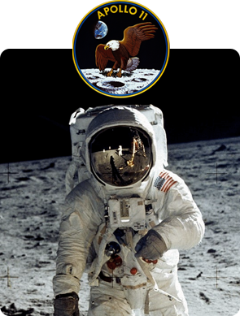
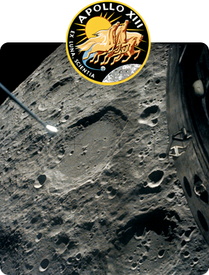
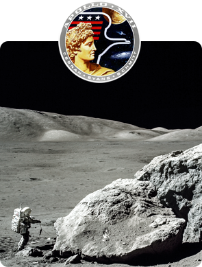

# Apollo in Real Time

**A real-time journey through the Apollo missions, told entirely through original
historical mission material.**

<p align="center">
  <a href="https://apolloinrealtime.org/11/"></a>
  <a href="https://apolloinrealtime.org/13/"></a>
  <a href="https://apolloinrealtime.org/17/"></a>
</p>

Apollo history is often presented as a handful of famous moments. Apollo in
Real Time restores the hours, days, people, and decisions around those moments.
It replays entire missions from before launch to recovery, placing the surviving
recordings and records back onto a single timeline so they can be experienced as
they happened.

Mission Control footage, film shot by the astronauts, television transmissions,
space-to-ground communications, onboard recordings, photography, transcripts,
and post-mission commentary are synchronized to Ground Elapsed Time—the master
mission clock. There is no narrator between you and the events. The archive tells
the story in the voices of the people who lived it.

**[apolloinrealtime.org](https://apolloinrealtime.org/)**

## Three journeys to the Moon

| Mission       | Journey                                                                                                                                                                                     | Explore                                             |
| ------------- | ------------------------------------------------------------------------------------------------------------------------------------------------------------------------------------------- | --------------------------------------------------- |
| **Apollo 11** | The first landing on the Moon. Follow the mission that carried Neil Armstrong, Buzz Aldrin, and Michael Collins from launch through humanity's first steps on another world and home again. | **[Relive 1969](https://apolloinrealtime.org/11/)** |
| **Apollo 13** | The third lunar landing attempt became a fight to bring Jim Lovell, Jack Swigert, and Fred Haise safely home after an oxygen-tank explosion crippled their spacecraft.                      | **[Relive 1970](https://apolloinrealtime.org/13/)** |
| **Apollo 17** | The last Apollo landing on the Moon and the program's longest lunar-surface expedition, flown by Gene Cernan, Harrison Schmitt, and Ron Evans.                                              | **[Relive 1972](https://apolloinrealtime.org/17/)** |

Start one minute before launch, join a mission in progress at its corresponding
historical time, or jump directly to any moment. The mission clock keeps audio,
video, transcripts, photography, commentary, spacecraft data, and the timeline
together as you explore.

Apollo 11 and Apollo 13 also include Mission Control recordings in unprecedented detail. Select a console
position to hear its restored communications loop alongside a visualization of
the room, channel activity, waveform, and available transcripts. Apollo 11
includes more than 11,000 hours of Mission Control audio; Apollo 13 includes more
than 7,200 hours. Much of this material was digitized and made publicly available
through this project for the first time.

## Restoring the historical record

This effort began as a reconstruction of Apollo 17: scanned technical transcripts
were converted, corrected, checked against the mission audio, and rebuilt into a
continuous timeline. That experience launched in 2015. Apollo 11 followed for
the 50th anniversary of the first Moon landing in 2019, and Apollo 13 followed
for its 50th anniversary in 2020. Each mission expanded the same idea: preserve
the source material, restore its timing, and let the historical record speak for
itself.

The project was conceived and created by
[Ben Feist](https://benfeist.com/) with the work of archive researchers,
historians, designers, programmers, transcript contributors, and staff at the
institutions that preserved and digitized the original material. Full
mission-specific acknowledgements are available from **Instructions / Credits**
inside each experience.

Discover and share notable moments with other explorers in the
[Apollo in Real Time Forum](https://forum.apolloinrealtime.org/).

## Developing the site

This repository contains the current static application for Apollo 11, Apollo
13, Apollo 17, and the mission landing page. It is written in strict TypeScript
with native browser APIs and Vite; the historical media and mission datasets are
served separately.

Use the Node.js version in [`.nvmrc`](.nvmrc), then run:

```bash
npm ci
npm run dev
```

| Local URL                    | Purpose              |
| ---------------------------- | -------------------- |
| `http://localhost:5173/`     | Mission landing page |
| `http://localhost:5173/11/`  | Apollo 11            |
| `http://localhost:5173/13/`  | Apollo 13            |
| `http://localhost:5173/17/`  | Apollo 17            |
| `http://localhost:5173/dev/` | Module smoke harness |

Run `npm run check` for type checking, linting, formatting, and unit tests. Run
`npm run build` and `npm run preview` to verify the production build.

Contributors should begin with [AGENTS.md](AGENTS.md), followed by the
[product contract and documentation map](docs-plan/README.md),
[architectural decisions](docs-plan/00-decisions.md), and
[visual reference](docs-plan/visual-reference.md).

The original Apollo 11, Apollo 13, Apollo 17, and landing-page histories remain
available under the namespaced `legacy/*` Git refs. Preserved source data and
processing work live in `mission-data/` and `pipeline/`; runtime application code
lives in `src/`.
